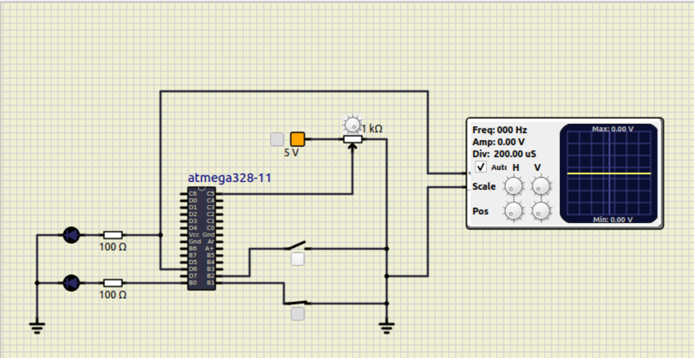

# Embedded_C_Activities_255949
Embedded C activities in StepIn Program

| Build                                                                                                                                                                                                    | Cppcheck                                                                                                                                                                                                         | Codacy                                                                                                                                                                                                                                                                                                 |
|----------------------------------------------------------------------------------------------------------------------------------------------------------------------------------------------------------|------------------------------------------------------------------------------------------------------------------------------------------------------------------------------------------------------------------|--------------------------------------------------------------------------------------------------------------------------------------------------------------------------------------------------------------------------------------------------------------------------------------------------------|
|  |  |  |

## Output

### Requirements not met

| None of the switches ON               | Only Heating Switch ON                  | Only Person present on seat              |
|---------------------------------------|-----------------------------------------|------------------------------------------|
|  |  |  |

### Both Switches ON

| Duty Cycle | Output                              | Serial Monitor                        |
|------------|-------------------------------------|---------------------------------------|
| 20%        |  |  |
| 40%        |  |  |
| 70%        |  |  |
| 95%        |  |  |